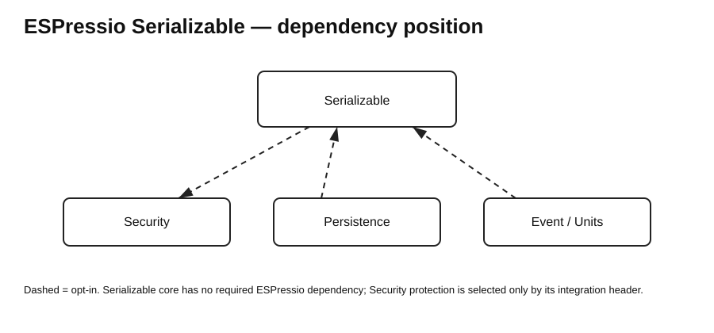

# ESPressio Dependency Chart — Serializable 0.11.0



Arrows point from consuming library to dependency. Solid arrows are required; dashed arrows are opt-in.

## Serializable dependency position

```text
Serializable 0.11.0 core
    -> none

Serializable Security integration
    - - -> Security main
            authenticated protected serialization
```

The normal `ESPressio_Serializable.hpp` umbrella remains Security-free. Only code including `ESPressio_Serializable_Security.hpp` introduces the optional Security edge.

## Coordinated feature cascade

```text
Security      0.4.0
Serializable  0.11.0
Persistence   0.3.0 (planned downstream in this tranche)
WiFi          0.1.0 (planned downstream in this tranche)
Serial        WiFi integration planned downstream
```

The key direction invariant is:

```text
Serializable - - -> Security
Security -> Serializable   NONE
```

This allows Serializable to offer authenticated archive protection without moving cryptographic implementation or key management into the serialization core.

Other existing integrations remain downstream:

```text
Units - - -> Serializable
Event - - -> Serializable
Persistence - - -> Serializable
```

Serial remains terminal/downstream. No upstream library should depend on Serial.
