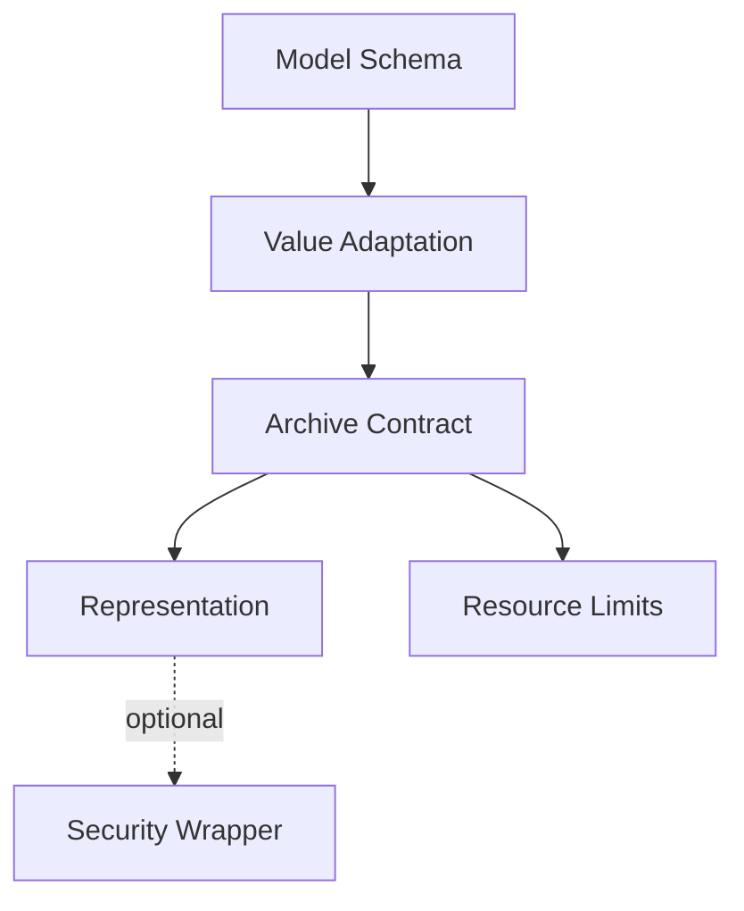

# Extension Architecture

Serializable extensions should preserve the split between model schema, value adaptation, archive representation, resource policy, and optional integrations.

## Extension boundaries

- add a representation by implementing archive behaviour, not by adding `ToX()` methods to every model;
- add C++ value support through reusable value adapters/schema machinery;
- keep migrations/defaults/aliases representation-neutral;
- keep Security optional and outside core schema declarations;
- keep allocator/buffer policy separate from semantic serialization behaviour.

## Invariants

New extensions must preserve detailed diagnostics, bounded decoding, schema-version handling, normal value semantics, and independence of the core from downstream ESPressio libraries.