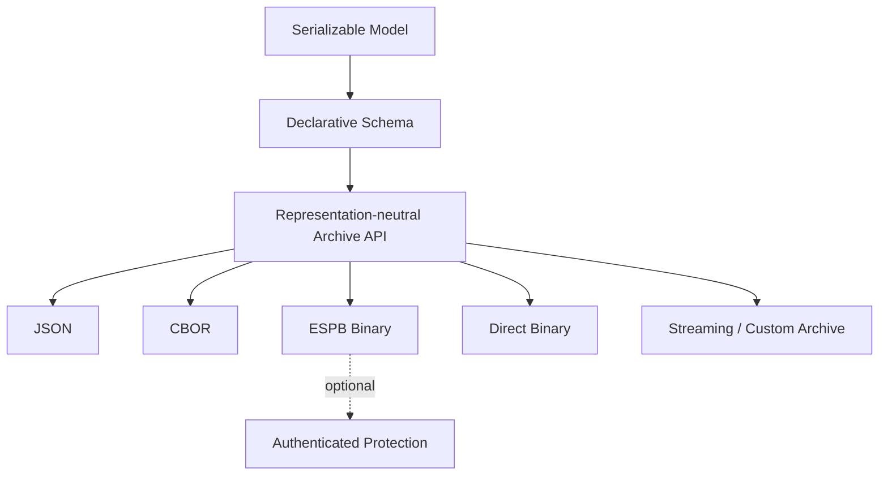

# ESPressio Serializable

> Documentation baseline: **1.0.0**

ESPressio Serializable provides declarative, representation-neutral serialization for the ESPressio Development Platform.

A C++ type declares which members constitute its serializable state once. Archives then decide whether that state becomes JSON, CBOR, ESPB Binary, direct Binary, a stream, a custom representation, or an optionally protected representation.

## Choose your documentation path

### Using the library

- [Getting Started](Getting-Started)
- [Declaring Serializable Types](Declaring-Serializable-Types)
- [Properties and Value Types](Properties-and-Value-Types)
- [JSON Archives](JSON-Archives)
- [CBOR Archives](CBOR-Archives)
- [ESPB Binary](ESPB-Binary)
- [Direct Binary](Direct-Binary)
- [Nested Values and Collections](Nested-Values-and-Collections)
- [Validation and Diagnostics](Validation-and-Diagnostics)
- [Schema Evolution](Schema-Evolution)
- [Streaming](Streaming)
- [Protected Serialization](Protected-Serialization)
- [Redaction](Redaction)
- [Memory and Decode Limits](Memory-and-Decode-Limits)

### Extending the library

- [Extension Architecture](Extension-Architecture)
- [Adding Archive Types](Adding-Archive-Types)
- [Adding Value Adapters](Adding-Value-Adapters)
- [Schema and Migration Contracts](Schema-and-Migration-Contracts)
- [Allocator and Buffer Strategy](Allocator-and-Buffer-Strategy)
- [Security Integration Contract](Security-Integration-Contract)
- [Testing Serializable Extensions](Testing-Serializable-Extensions)

## Architecture

Core Serializable remains independent of Security and other ESPressio libraries; integrations are explicitly optional.